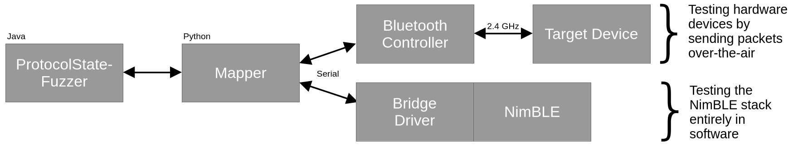

# BLE-Fuzzer

This is a test setup to apply protocol state fuzzing to Bluetooth Low Energy (BLE) devices.
It is built upon the [ProtocolState-Fuzzer](https://github.com/protocol-fuzzing/protocol-state-fuzzer) framework and can be used to either test hardware devices over-the-air or to test the NimBLE stack in a Linux process.



**src/** contains code that configures ProtocolState-Fuzzer (PSF) and acts as a bridge between PSF and the mapper. This is done using [jep](https://github.com/ninia/jep), which allows embedding a CPython interpreter in a Java process.

**py/** contains the mapper. Different "flavors" exist, subclassing a generic mapper to deal with device specific behavior. The mapper uses [Scapy](https://github.com/secdev/scapy) to construct and parse BLE packets.

**experiments/alphabets/** contains different alphabets (subsets of BLE packet types) that can be used for testing.

**experiments/args/** contains test configurations (lists of PSF arguments) for devices that have already been tested.

**experiments/results/** contains results after tests have been run.

**experiments/results_saved/** contains results of previous test runs. Mostly for comparison in the CI.

**experiments/targets/** contains test-apps/firmware for devices that have been tested.

**experiments/tests/** contains test sequences of interest. For example, specific test sequences can be run to reproduce bugs.

**scripts/** contains miscellaneous scripts for resetting targets and for CI runs.


## Getting Started

Note: See also [.github/workflows/ci.yml](.github/workflows/ci.yml) for the following steps. If build errors occur with the latest versions of ProtocolState-Fuzzer or NimBLE, try the commits specified there.

1. Install ProtocolState-Fuzzer according to its [installation instructions](https://github.com/protocol-fuzzing/protocol-state-fuzzer?tab=readme-ov-file#installation)
2. Set up and activate a python environment for ble-fuzzer: `source scripts/setup_venv.sh`
3. Build ble-fuzzer: `mvn package`
4. Build (and flash) one of the targets following the instructions in `experiments/targets/xxx`
5. Flash the SweynTooth firmware to the test dongle following the [instructions below](#flashing-the-sweyntooth-firmware)
6. Find out the MAC address of the device that is being tested (e.g. by using the "nRF Connect" app on a phone)
7. Start learning: `java -jar target/ble-fuzzer-1.0-SNAPSHOT.jar @experiments/args/nRF52840_pairing -adapter /dev/device_4B8150861D56F596 -connect EB:D8:6B:33:90:0B`


### Flashing the SweynTooth Firmware

To test hardware devices, the nRF52840 dongle is used with the firmware developed in the [SweynTooth](https://github.com/Matheus-Garbelini/sweyntooth_bluetooth_low_energy_attacks) project to send BLE packets over-the-air. The firmware can be flashed to the dongle with the following steps:

1. Download the [firmware](https://github.com/apferscher/ble-learning/blob/main/firmware/nRF52840_dongle_firmware.hex) and [softdevice](https://github.com/apferscher/ble-learning/blob/main/firmware/s140_nrf52_6.1.1_softdevice.hex) file
2. Load both into the [nRF Connect for Desktop](https://www.nordicsemi.com/Products/Development-tools/nRF-Connect-for-Desktop) app (under the "Programmer" app)
3. Insert the the nRF52840 dongle and put it into bootloader mode
    - To get into bootloader mode, the small reset button needs to be pressed
    - Attention: The reset button is not the white button that's clearly visible. There's another button right next to it that goes sideways.
4. Select the dongle in the programmer and flash the firmware

Once the dongle is flashed, it should register a serial interface (e.g. `/dev/ttyACM0`). Since the number of the interface can vary if multiple devices are plugged in, I recommend creating a udev rule that allows identifying the device based on its serial number. To do that, create a file `/etc/udev/rules.d/85-serial.rules` with the contents:

```
SUBSYSTEM=="tty",SUBSYSTEMS=="usb",DRIVERS=="usb",SYMLINK+="device_%s{serial}",MODE="0666"
```

The dongle can then be referred to as `/dev/device_xxxxxxxxxxxxxxxx`.


### Arguments

For convenience, most required arguments for ProtocolState-Fuzzer have been collected in files under `experiments/args` and can be used on the command line by prefixing the file with an "@" (see [Getting Started](#getting-started) for an example). A full command to start learning a device would look like this:

```sh
java -jar target/ble-fuzzer-1.0-SNAPSHOT.jar state-fuzzer-server -output experiments/results/nRF52840_pairing -alphabet experiments/alphabets/pairing.xml -equivalenceQueryBound 5000 -logQueries -mapper nRF52840 -adapter /dev/device_4B8150861D56F596 -connect EB:D8:6B:33:90:0B
```

**state-fuzzer-server** means that a server implementation (a peripheral) is being fuzzed. This is the only supported mode in this setup.

**-output** allows specifying a path to a directory where the learned models and statistics will be written to.

**-alphabet** allows specifying a file with the alphabet (input symbols) used for testing. If unspecified, the default (`src/main/resources/default_alphabet.xml`) will be used.

**-equivalenceQueryBound** allows specifying how many test sequences should be used to check if a generated hypothesis corresponds to the actual behavior of the SUT. 5000 was found to be a good value when learning the paring procedure (and key re-negotiation) of BLE devices.

**-logQueries** makes sure that the generated queries are logged for debugging.

**-mapper** allows choosing a mapper for testing. If omitted, the generic mapper `py/BLESUL.py` will be used. If specified, the mapper `py/BLESUL_<mapper>.py` is used.

**-adapter** must specify a serial interface via which the mapper sends/receives packets. This can be an interface to the BLE dongle used for testing or to the driver of the NimBLE stack when tested on Linux.

**-connect** must specify the BLE MAC address of the device that is being tested.


### Testing Specific Input-Sequences

To test specific input sequences, for example to reproduce a bug, the `-test` flag can be used:

```sh
java -jar target/ble-fuzzer-1.0-SNAPSHOT.jar @experiments/args/NimBLE_pairing -adapter /dev/pts/5 -connect 11:22:33:44:55:66 -test experiments/tests/pair_att_read.txt
```

Specify optionally `-times <n>` to run the input sequence multiple times.


## Credits
- `py/**` is based on work done in [apferscher/ble-learning](https://github.com/apferscher/ble-learning) and [Matheus-Garbelini/sweyntooth_bluetooth_low_energy_attacks](https://github.com/Matheus-Garbelini/sweyntooth_bluetooth_low_energy_attacks)
- `experiments/targets/nRF52840` is based on an example in [NordicDeveloperAcademy/bt-fund](https://github.com/NordicDeveloperAcademy/bt-fund/tree/main/l5/l5_e1)
- `experiments/targets/RPiPico2W` is based on an example in [raspberrypi/pico-examples](https://github.com/raspberrypi/pico-examples/tree/master/pico_w/bt/standalone)
- `scripts/diff_hyps.sh` is copied from [protocol-fuzzing/edhoc-fuzzer](https://github.com/protocol-fuzzing/edhoc-fuzzer/blob/main/scripts/diff_hyps.sh)